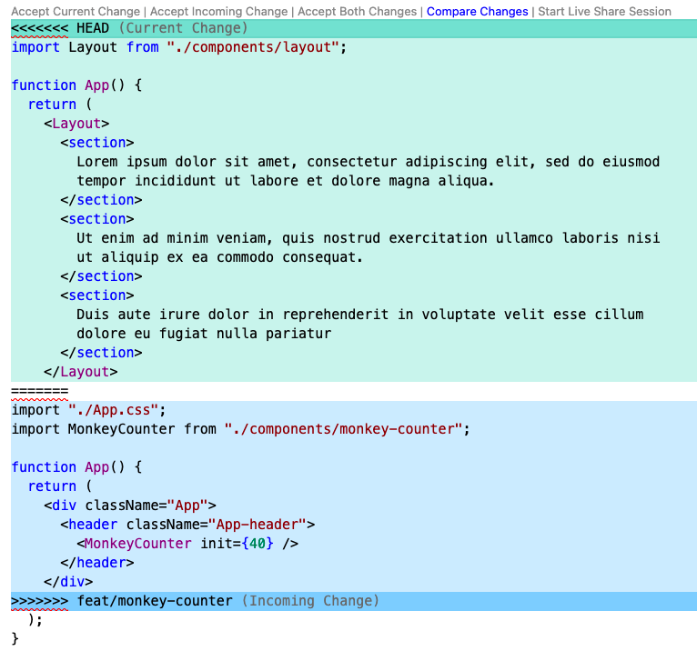
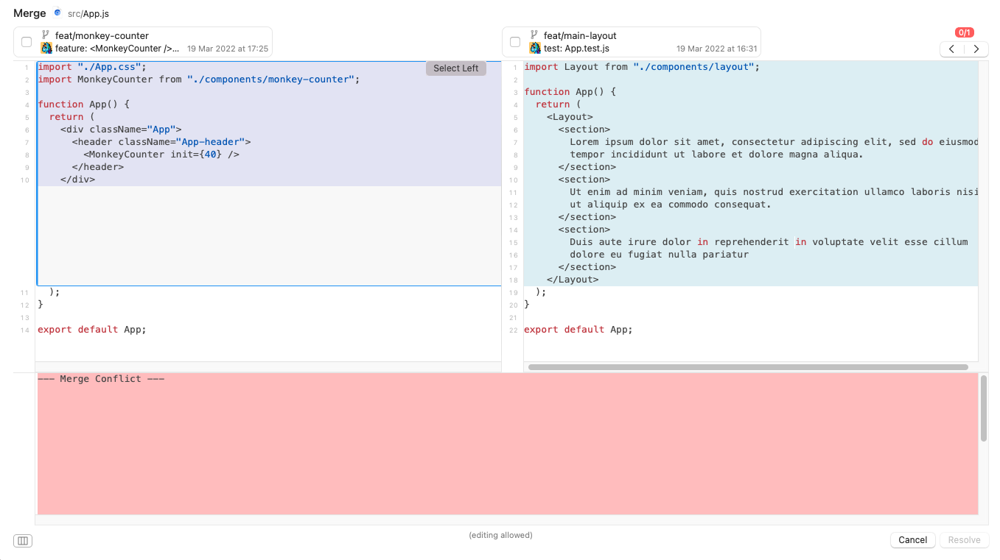

## Git conflicts

1. not fear them
2. Once you've committed, you can't loose your work
3. Again: **You can't loose your work**.

- theirs vs. mine
- focus on how will looks like in the end.

> strategy ♟: take other's option as base, then re-implement your idea again

### Workshop

[manuartero/octo-git-42](https://github.com/manuartero/octo-git-42)

### VSCode

### Fork

